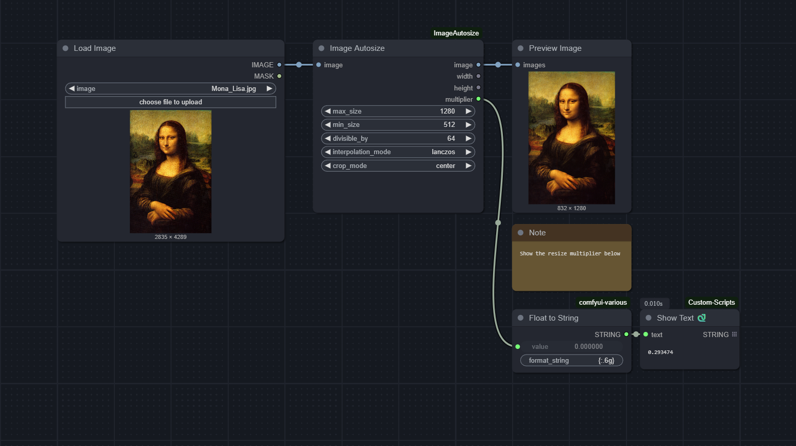

# ComfyUI-ImageAutosize

A node for [ComfyUI](https://github.com/comfyanonymous/ComfyUI) that provides a convenient way of resizing or cropping an image for diffusion tasks.

This node was designed with the goal of being easy to "set and forget," allowing you to pre-process any input image without having to frequently adjust your parameters.

### Installation

Simply drag the image above into ComfyUI and use [ComfyUI Manager » Install Missing Custom Nodes](https://github.com/ltdrdata/ComfyUI-Manager).

### Inputs

- `image`: The image to modify.
- `max_size` (int): The node will resize the **larger dimension** of the `image` to this size in pixels, preserving aspect ratio.
- `min_size` (int): After evaluating `max_size`, the node will check the **smaller dimension** of the `image`. If it's less than `min_size`, the smaller dimension will be upscaled to this value, preserving aspect ratio.
- `divisible_by` (int): After evaluating both `max_size` and `min_size`, the dimensions of the image will be rounded to values that are multiples of `divisible_by`. This is useful for diffusion models, which often expect sizes that are divisible by 32.
- `interpolation_mode` (string): Name of the resizing method.
- `crop_mode` (string): Cropping is often needed to satisfy `divisble_by`, and this input lets you choose the origin of the crop. Set it to `none` to disable cropping altogether.

### Outputs

- `image` (image): The modified image.
- `width` (int): The resulting image width in pixels.
- `height` (int): The resulting image height in pixels.
- `multiplier` (float): The multiplier applied to the original image's dimensions. Useful if you want to resize another image or mask by the same amount.

---

This node was adapted from the `[img2img_autosize]` shortcode of [Unprompted](https://github.com/ThereforeGames/unprompted), my Automatic1111 extension.